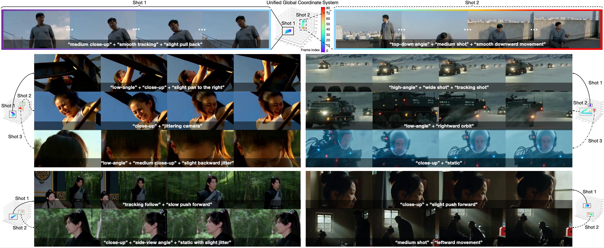

# ShotVerse: Advancing Cinematic Camera Control for Text-Driven Multi-Shot Video Creation

<p align="center">

</p>

Text-driven video generation has democratized film creation, but camera control in cinematic multi-shot scenarios remains a significant block. Implicit textual prompts lack precision, while explicit trajectory conditioning imposes prohibitive manual overhead and often triggers execution failures in current models. To overcome this bottleneck, we propose a data-centric paradigm shift, positing that aligned (Caption, Trajectory, Video) triplets form an inherent joint distribution that can connect automated plotting and precise execution. Guided by this insight, we present ShotVerse, a "Plan-then-Control" framework that decouples generation into two collaborative agents: a VLM (Vision-Language Model)-based Planner that leverages spatial priors to obtain cinematic, globally aligned trajectories from text, and a Controller that renders these trajectories into multi-shot video content via a camera adapter. Central to our approach is the construction of a data foundation: we design an automated multi-shot camera calibration pipeline aligns disjoint single-shot trajectories into a unified global coordinate system. This facilitates the curation of ShotVerse-Bench, a high-fidelity cinematic dataset with a three-track evaluation protocol that serves as the bedrock for our framework. Extensive experiments demonstrate that ShotVerse effectively bridges the gap between unreliable textual control and labor-intensive manual plotting, achieving superior cinematic aesthetics and generating multi-shot videos that are both camera-accurate and cross-shot consistent.

**Paper:** [https://arxiv.org/abs/2603.11421](https://arxiv.org/abs/2603.11421)

## 🚧 Code Release Plan

Code will be released after paper acceptance.

- [ ] Pre-trained models
- [ ] Inference code
- [ ] Dataset
- [ ] Training code

If you find this work useful, please consider citing:

```bibtex
@misc{yang2026shotverseadvancingcinematiccamera,
      title={ShotVerse: Advancing Cinematic Camera Control for Text-Driven Multi-Shot Video Creation}, 
      author={Songlin Yang and Zhe Wang and Xuyi Yang and Songchun Zhang and Xianghao Kong and Taiyi Wu and Xiaotong Zhao and Ran Zhang and Alan Zhao and Anyi Rao},
      year={2026},
      eprint={2603.11421},
      archivePrefix={arXiv},
      primaryClass={cs.CV},
      url={https://arxiv.org/abs/2603.11421}, 
}
